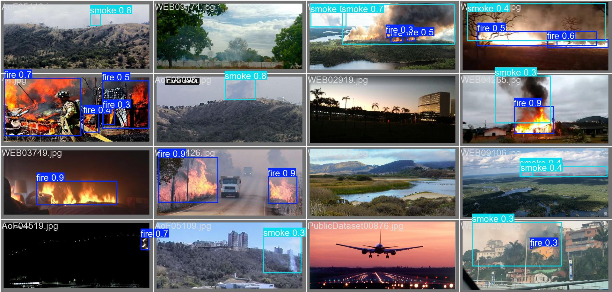

# Fire Detection System

A real-time fire detection system using an ESP32 camera module and a Jetson Nano running Ultralytics YOLO. The ESP32 streams video data over WiFi, while the Jetson Nano processes the video stream to detect fire/smoke and POST back the results. The results are used in combination with an infrared sensor to detect fire.

## System Overview
1. **ESP32** streams video data over WiFi and reads sensor data.
2. **Jetson Nano** discovers the ESP32 (via mDNS or manual IP), receives the video stream, and runs YOLO-based fire detection.
3. If fire is detected (from video and confirmed by IR sensor), the system can trigger alerts or further actions.

### Project Structure
- `esp32/` — Firmware and configuration for the ESP32 camera module
- `jetson/` — Python code for fire detection and ESP32 discovery on Jetson Nano
- `yolov8/` — YOLO training, datasets, and demo notebooks

## ESP32 Camera Module

This folder contains the firmware and configuration files for running fire detection on the XIAO ESP32S3 (Sense). The ESP32 streams video over WiFi, can be automatically discovered by the Jetson Nano using mDNS, and uses the YOLO detections in combination with an infrared sensor to detect fire.

### Contents
- `esp32.ino` — Main Arduino sketch for running fire detection on the ESP32 camera module.
- `CameraWebServer.ino` — Web server code for streaming video from the ESP32 camera.
- `Sensors.ino` — Contains sensor setup and reading logic.
- `app_httpd.cpp` — HTTP server implementation for handling video streaming and requests.
- `config.h` — Configuration file for WiFi credentials and sensor settings.

### Requirements
- XIAO ESP32S3 (Sense)
- Arduino IDE
- ESP32 board support installed in Arduino IDE
- The following libraries installed via Library Manager:
    - `ArduinoMDNS`
    - `ArduinoJson`

### Setup Instructions
1. Open `esp32.ino` in Arduino IDE.
2. Edit `config.h` and enter your WiFi credentials:
   ```cpp
   const char *ssid = "YOUR_WIFI_SSID";
   const char *password = "YOUR_WIFI_PASSWORD";
   ```
3. Connect your ESP32 to your computer.
4. Select the XIAO_ESP32S3 board in Arduino IDE:
   - Go to `Tools` -> `Board` -> `esp32` -> `XIAO_ESP32S3`
   - Ensure the correct port is selected under `Tools` -> `Port`.
5. Upload the firmware to the ESP32.
6. Open the Serial Monitor to view the device's IP address and status messages.

## Jetson Fire Detection Module

This folder contains the code for running fire detection on a Jetson Nano using video streamed from an ESP32 camera module. The Jetson Nano uses an Ultralytics YOLO model to detect fire in real time and POSTs the inference results back to the ESP32.

### Contents
- `main.py` — Main entry point for running fire detection and handling ESP32 discovery
- `fire_detection.py` — Contains the fire detection logic using Ultralytics YOLO and OpenCV
- `esp32_discovery.py` — Handles automatic discovery of the ESP32 camera using mDNS/zeroconf
- `requirements.txt` — Python dependencies for this module

### Requirements
- Python 3.10+
- Jetson Nano
- ESP32 camera module streaming video on the same network

### Python Dependencies
Install all dependencies with:
```sh
pip install -r requirements.txt
```

### Usage
1. Make sure your ESP32 camera is running and connected to the same network as the Jetson Nano.
2. Run the main script:
   ```sh
   python3 main.py [--display] [--ip <ESP32_IP>] [--weights <YOLO_WEIGHTS_PATH>]
   ```

#### Arguments
- `--display` : (Optional) Show the video stream with fire detection results in a window.
- `--ip <ESP32_IP>` : (Optional) Manually specify the ESP32 camera's IP address. If not provided, the script will attempt to discover the ESP32 automatically using mDNS.
- `--weights <YOLO_WEIGHTS_PATH>` : (Optional) Path to the Ultralytics YOLO weights file. Defaults to `best.pt` in this folder if not specified.

**Examples:**
- Auto-discover ESP32 and display inference output:
  ```sh
  python3 main.py --display
  ```
- Specify ESP32 IP manually:
  ```sh
  python3 main.py --ip 192.168.x.x
  ```
- Use a custom YOLO weights file:
  ```sh
  python3 main.py --weights yolo11n.pt
  ```

## Fire and Smoke Detection using YOLOv8

Real-time fire and smoke detection using YOLOv8. Trained on multiple aggregated datasets. This folder contains a notebook demonstrating usage and performance of the model in both image and video detection.

### Datasets Used
The following datasets were aggregated and relabelled for training the YOLOv8 model:


[YOLOv8-Fire-and-Smoke-Detection](https://github.com/Abonia1/YOLOv8-Fire-and-Smoke-Detection) (Small dataset for fire and smoke)

[DFireDataset](https://github.com/gaiasd/DFireDataset) (Large dataset for fire and smoke)

[yolov5-fire-detection](https://github.com/spacewalk01/yolov5-fire-detection) (Medium dataset for fire only)

### Images


### Videos

#### Firefighting


#### Indoors


#### Outdoors


