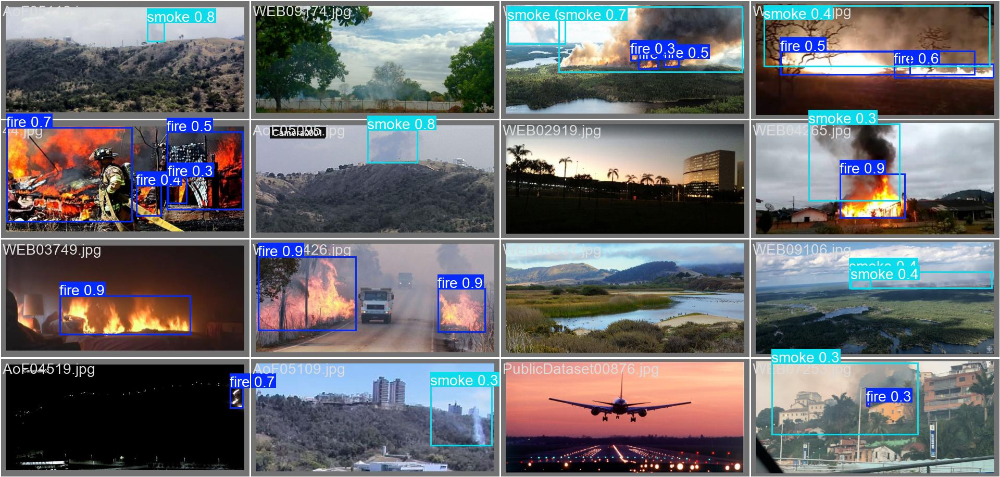

# Fire and Smoke Detection using YOLOv8

Real-time fire and smoke detection using YOLOv8. Trained on multiple aggregated datasets. This repo contains a notebook demonstrating usage and performance of the model in both image and video detection. 

## Datasets Used
[YOLOv8-Fire-and-Smoke-Detection](https://github.com/Abonia1/YOLOv8-Fire-and-Smoke-Detection) (Small dataset for fire and smoke)

[DFireDataset](https://github.com/gaiasd/DFireDataset) (Large dataset for fire and smoke)

[yolov5-fire-detection](https://github.com/spacewalk01/yolov5-fire-detection) (Medium dataset for fire only)

### Combined Dataset
I have aggregated the above datasets into a single dataset that can be downloaded here:

[Aggregated Dataset](https://drive.google.com/file/d/14KOvHkB3z-txUeyITVZnyM0zKAADfcKs/view?usp=sharing)

## Images

## Videos

### Firefighting

### Indoors

### Outdoors

